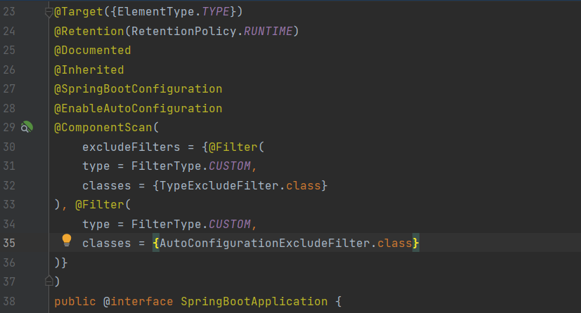

## Spring AOP
Spring AOP can be used to define common behaviors at different points in the application, reducing code repetition, increasing modularity, and improving code readability. Additionally, many features of the Spring Framework, such as transaction management, event management, security management, caching, and performance monitoring, are implemented using Spring AOP.

Spring AOP is used to apply specific behaviors at join points. A Joinpoint is a point during the execution of a program, such as the execution of a method or the handling of an exception. In Spring AOP, a JoinPoint always represents a method execution.

A Pointcut is a predicate that helps match an Advice to be applied by an Aspect at a particular JoinPoint.

We often associate the Advice with a Pointcut expression, and it runs at any Joinpoint matched by the Pointcut.

Spring AOP determines how to handle join points using proxy objects.

Spring AOP accesses objects through proxy (delegate) objects. Proxy objects are used in place of real objects and control object management. 

Since proxy objects are used by aspects, there is no need to modify real objects. This allows aspects to be applied during application runtime without making any changes.

Advices define how an aspect should apply specific behaviors at join points. Spring AOP supports various types of advice, which are defined using annotations such as @Before, @After, @Around, @AfterReturning, @AfterThrowing, and @DeclareParents. For example, the @Transactional annotation uses @Around advice to manage transactions.


#### Usage

Firstly, add dependency.

```
<dependency>
			<groupId>org.springframework.boot</groupId>
			<artifactId>spring-boot-starter-aop</artifactId>
		</dependency>
```

Add to the main class (For AOP to handle classes that do not implement interfaces, the proxyTargetClass must be set to true.):
```
@EnableAspectJAutoProxy(proxyTargetClass = true)
```

Then create a aspect class. Add `` @Aspect `` and  ``@Component`` annotations to that class.

In this project, an Aspect class (com.example.helloworld.Aspect) has been created as an example.

#### Example usage of @Before advice:

In the Before advice, we specify which method or methods we will handle with the "execution(* com.example.helloworld.worker.PutProductWorker.execute(..))" pointcut query.

If we wanted to listen to all methods named execute in the Worker package, we could have used ``*`` instead of PutProductWorker. Or, if we wanted to listen to all methods in the PutProductWorker class, we could have used ``*`` instead of execute.

We write the code that we want to run before the execute method in the PutProductWorker class inside the method. We can access the parameter of the listened method with the Joinpoint object.
```
    @Before("execution(* com.example.helloworld.worker.PutProductWorker.execute(..))")
    public void beforeMethod(JoinPoint joinPoint) {
        System.out.println("Caught a parameter before execution of method " + joinPoint.getArgs()[0]);
        System.out.println(joinPoint.getSignature());
    }

```

#### Example usage of @After advice:

We write the code that we want to run after the execute method in the PutProductWorker class inside the method. 
```
    @ @After("execution(* com.example.helloworld.worker.PutProductWorker.execute(..))")
    public void afterMethod(JoinPoint joinPoint) {
        System.out.println("The method is completed");
    }

```

#### Example usage of @AfterReturning advice:
Here, unlike in the after advice, we can also obtain the object returned by the listened method. We add the returning value as the second parameter inside the advice. Additionally, we add a parameter for the object to be returned outside of the Joinpoint inside the method.

We write the code that we want to run after the execute method in the PutProductWorker class inside the method.
```
    @AfterReturning(value = "execution(* com.example.helloworld.worker.PutProductWorker.execute(..))", returning = "taskResult")
    public void afterReturningMethod(JoinPoint joinPoint, TaskResult taskResult) {
        System.out.println("The method is completed. Returned: " + taskResult.toString());
        System.out.println(joinPoint.getSignature());
    }
    }

```


#### Example usage of @Around advice:
Thanks to the Around advice, we can perform operations before the listened method is executed, perform checks with these operations to prevent the listened method from continuing to work, and obtain the object returned by the listened method if the listened method continues to work.
For this, unlike other advices, we take the ProceedingJoinPoint object as a parameter instead of the JoinPoint object.

In this example, we prevent the listened method from running if there are 2 breads in the products list in the incoming request. Otherwise, we print the returned object to the console.
```
    @Around("execution(* com.example.helloworld.worker.PutProductWorker.execute(..))")
    public Object aroundMethod(ProceedingJoinPoint joinPoint) throws Throwable {
        Task task = (Task) joinPoint.getArgs()[0];
        List<String> products = (List<String>) task.getInputData().get("products");
        if (products.stream().filter(product -> "bread".equals(product)).count() == 2)
            return null;

        Object object = joinPoint.proceed();
        System.out.println("Return of around method: " + object.toString());

        return object;
    }

```
#### AOP on @Transactional:
```
    @Transactional
    public void registerUser(User user) {
       // execute some SQL that e.g.
        // inserts the user into the db and retrieves the autogenerated id
        userDao.save(user);
    }
    }

```
The @Transactional registerUser code above translates (simplified) directly to this:
```
public void registerUser(User user) {
        Connection connection = dataSource.getConnection(); // (1)
        try (connection) {
            connection.setAutoCommit(false); // (1)

            // execute some SQL that e.g.
            // inserts the user into the db and retrieves the autogenerated id
            // userDao.save(user); <(2)

            connection.commit(); // (1)
        } catch (SQLException e) {
            connection.rollback(); // (1)
        }
    }
```

## Spring IOC

In Spring Framework and Spring Boot, Inversion of Control (IoC) is implemented using the concept of beans, which are objects that can be wired together to form an application. Beans can be created, managed, and wired together using the ApplicationContext, which is a container for beans.

One way to create beans in Spring is through the use of component scanning. Component scanning is a mechanism that allows the framework to automatically detect and instantiate beans based on certain criteria, such as annotations, classpath location, or naming conventions. This eliminates the need to manually define every bean in configuration files, and helps reduce boilerplate code.

To enable component scanning in a Spring application, the @ComponentScan annotation can be used. This annotation is typically placed on the main application class and specifies the packages to be scanned. Once the application context is created, the framework will scan these packages and automatically register any beans that meet the criteria.

@ComponentScan is already included in @SpringBootApplication annotation :



The ApplicationContext also supports the creation of hierarchical contexts, which can be used to manage the lifecycle of related beans. This allows for more fine-grained control over bean creation and management.

We can get a bean by using applicationContext in our application: 

```
@Autowired
private ApplicationContext applicationContext;

MyBean myBean = applicationContext.getBean(MyBean.class);

```

In Spring Boot, the ApplicationContext is automatically created and configured based on the application's configuration files and annotations.

## Spring Dependency Injection

Dependency injection is a pattern we can use to implement IoC, where the control being inverted is setting an object's dependencies.

Connecting objects with other objects, or “injecting” objects into other objects, is done by an assembler rather than by the objects themselves.

#### Constructor-Based Dependency Injection Example

```
public class Store {
    private final Item item;

    @Autowired
    public Store(Item item) {
        this.item = item;
    }
}

```

#### Field-Based Dependency Injection Example

In case of Field-Based DI, we can inject the dependencies by marking them with an @Autowired annotation:


```
public class Store {
    @Autowired
    private Item item; 
}

```


