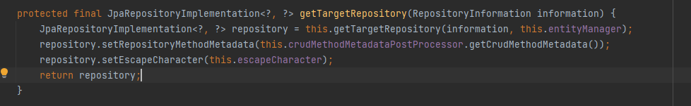
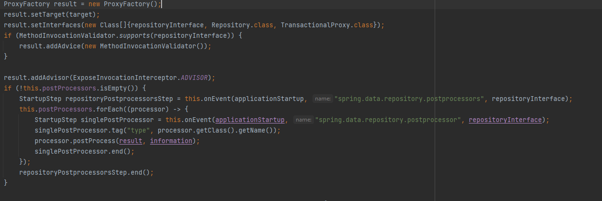
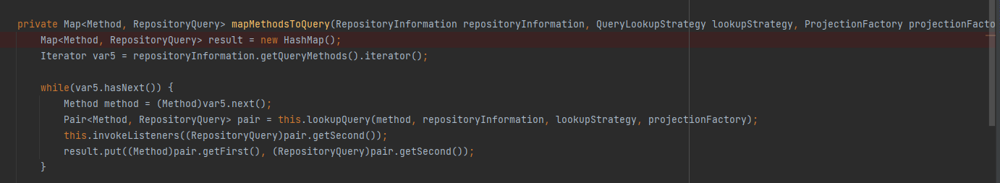
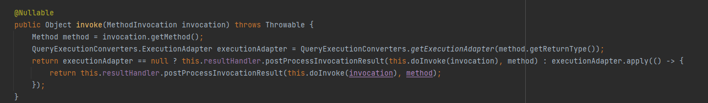

## Java Persistence API (JPA) 

### Entity

The Java Persistence API (JPA) provides a standard way for Java developers to interact with databases. Database operations often consist of repetitive, low-level SQL codes, and maintaining and managing these codes can be time-consuming. JPA allows developers to access the database via object-relational mapping (ORM), without having to rewrite these repetitive tasks.

An Entity in JPA is a class that represents a table in a database. An Entity class usually contains a table and fields that represent the columns of the table. Each instance of an entity represents a row in the table.

```
@Entity
@Table(name = "students")
public class Student {
    @Id
    @GeneratedValue(strategy = GenerationType.IDENTITY)
    private Long id;

    @Column(name = "name",unique = true, nullable = false, length = 50)
    private String name;

    @Column(name = "age")
    private int age;

    @ManyToMany(cascade = CascadeType.ALL)
    @JoinTable(
            name = "student_course",
            joinColumns = @JoinColumn(name = "student_id"),
            inverseJoinColumns = @JoinColumn(name = "course_id")
    )
    private Set<Course> courses = new HashSet<>();
```

@Entity: This annotation indicates that a class is an entity representing a database table. Through this annotation, JPA knows that this class needs to be associated with a table.

@Table: This annotation indicates which database table an entity is associated with. The 'name' parameter specifies the name of the table in the database.

@Id: This annotation indicates that a field is the primary key of this entity. A primary key ensures each row in a table is uniquely identifiable.

@GeneratedValue: This annotation indicates how the primary key will be generated. The 'strategy' parameter specifies the strategy to be used. The GenerationType.IDENTITY strategy typically represents an auto-incrementing value.

@Column: This annotation indicates that a field corresponds to a column in a database table. The 'name' parameter specifies the name of the column. The 'unique' parameter indicates that the column should contain a unique value. The 'nullable' parameter indicates whether the column can be empty or not. The 'length' parameter specifies the maximum number of characters in the column.

@ManyToMany: This annotation indicates a many-to-many relationship. In such a relationship, an item can be associated with multiple items, and each item can also be associated with multiple items.

@JoinTable: This annotation specifies how the join table will be created in a many-to-many relationship. The 'name' parameter specifies the name of the join table. The 'joinColumns' and 'inverseJoinColumns' parameters specify the columns in the join table.

@JoinColumn: This annotation specifies a join column. The 'name' parameter specifies the name of the join column.

CascadeType.ALL: This allows changes in an entity to automatically propagate to associated entities. This is used, for example, when an item is deleted, the associated items are also deleted.

orphanRemoval: This attribute specifies that the removal of an entity from a collection results in the removal of that entity from the database. For example, if a Course entity is removed from a Student's collection and orphanRemoval is set to true, this Course entity will also be deleted from the database.

### Repository and Queries 

In Spring Data JPA, a repository is an interface that provides CRUD operations for a specific type of entity. These CRUD operations are usually standard operations like findAll(), findById(), save(), delete(). Users can add custom methods to the repository interface to define complex queries.

Custom methods work with queries derived from method names. For example, the method findByName(String name) looks for an entity with the given name. Such methods allow query generation through method name resolution.

```
public interface UserRepository extends JpaRepository<User, Long> {

  List<User> findByLastname(String lastname);

  User findByEmailAddress(String emailAddress);
}

```
You can limit the results of query methods by using the first or top keywords, which you can use interchangeably. You can append an optional numeric value to top or first to specify the maximum result size to be returned. If the number is left out, a result size of 1 is assumed. The following example shows how to limit the query size:

```
User findFirstByOrderByLastnameAsc();

User findTopByOrderByAgeDesc();

Page<User> queryFirst10ByLastname(String lastname, Pageable pageable);

Slice<User> findTop3ByLastname(String lastname, Pageable pageable);

List<User> findFirst10ByLastname(String lastname, Sort sort);

List<User> findTop10ByLastname(String lastname, Pageable pageable);
```

For complex database interactions, method name resolution might not be sufficient or practical. That's where the use of Native Query, Criteria Query, QueryDSL, and Specification comes into play, offering more flexible and powerful ways to interact with the database.

Native Query: In cases where you need to write SQL queries directly due to the complexity of the query or the need for a specific database feature, native queries are used. These are actual SQL queries written as strings in your application. While this method is very powerful and flexible, it lacks type safety and is susceptible to errors like syntax mistakes or incorrect column names that are only caught at runtime.
Native queries can be used with entityManager.createquery or @Query annotation on repository
In NativeQueriesTest class: 

```
@Test
	public void native_queries_basic() {
		Query query = em.createNativeQuery("SELECT * FROM COURSE", Course.class);
		List resultList = query.getResultList();
		logger.info("SELECT * FROM COURSE  -> {}", resultList);
	}

	@Test
	public void native_queries_with_parameter() {
		Query query = em.createNativeQuery("SELECT * FROM COURSE where id = ?", Course.class);
		query.setParameter(1, 10010L);
		List resultList = query.getResultList();
		logger.info("SELECT * FROM COURSE  where id = ? -> {}", resultList);
		//[Course[Math]]
	}

	@Test
	public void native_queries_with_named_parameter() {
		Query query = em.createNativeQuery("SELECT * FROM COURSE where id = :id", Course.class);
		query.setParameter("id", 10001L);
		List resultList = query.getResultList();
		logger.info("SELECT * FROM COURSE  where id = :id -> {}", resultList);
	}

	@Test
	@Transactional
	public void native_queries_to_update() {
		Query query = em.createNativeQuery("Update COURSE set last_updated_date=CURRENT_DATE()");
		int noOfRowsUpdated = query.executeUpdate();
		logger.info("noOfRowsUpdated  -> {}", noOfRowsUpdated);
	}

```

In CourseSpringDataRepository class: 

```
   @Query(value = "Select  *  From Course c where c.name like '%Math'", nativeQuery = true)
    List<Course> courseWithMathInNameUsingNativeQuery();

```

JPQL : JPQL, or Java Persistence Query Language, is a platform-independent object-oriented query language defined as part of the Java Persistence API (JPA) specification. JPQL is used to make queries against entities stored in a relational database. It is an abstraction over SQL and provides a way to perform database operations based on the entity model rather than on the database tables.JPQL is similar to SQL, but it operates on objects, attributes, and relationships instead of tables and columns.
JPQL queries can be used with entityManager.createquery or @Query annotation on repository.

In JPQLTest class:

```
@Test
	public void jpql_basic() {
		Query query = em.createQuery("Select  c  From Course c");
		List resultList = query.getResultList();
		logger.info("Select  c  From Course c -> {}",resultList);
	}


	@Test
	public void jpql_typed() {
		TypedQuery<Course> query =
				em.createQuery("Select  c  From Course c", Course.class);

		List<Course> resultList = query.getResultList();

		logger.info("Select  c  From Course c -> {}",resultList);
	}

	@Test
	public void jpql_where() {
		TypedQuery<Course> query =
				em.createQuery("Select  c  From Course c where name like '%Math'", Course.class);

		List<Course> resultList = query.getResultList();

		logger.info("Select  c  From Course c where name like '%Math'-> {}",resultList);
	}

```
In CourseSpringDataRepository class:

```
    @Query("Select  c  From Course c where c.name like '%Math'")
    List<Course> courseWithMathInName();


```


Criteria Query: The Criteria API is a predefined API that is used to define queries for entities stored in a relational database. It is type-safe, meaning the Java compiler verifies the query construction and alerts you to any errors at compile time. The main advantage of the Criteria API is its ability to create complex queries programmatically, which can be very useful in scenarios where the exact structure of the query is not known at compile time and is built based on user input or application state.
example of a Criteria Query that fetches a Student entity based on a given name:

```
// Assume that we have an EntityManager instance 'em'
CriteriaBuilder cb = em.getCriteriaBuilder();
CriteriaQuery<Student> cq = cb.createQuery(Student.class);

Root<Student> student = cq.from(Student.class);
cq.select(student).where(cb.equal(student.get("name"), "givenName"));

TypedQuery<Student> query = em.createQuery(cq);
List<Student> result = query.getResultList();

```

QueryDSL: Similar to Criteria Query, QueryDSL is a framework that enables the construction of type-safe SQL-like queries. It can be seen as an alternative to both JPQL and Criteria Queries. QueryDSL excels in situations where you need to create a query dynamically and in a readable and secure manner.

```

QStudent student = QStudent.student;

Predicate predicate = student.name.equalsIgnoreCase("dave");

courseSpringDataRepository.findAll(predicate);


```

Specification: Specification is a part of Spring Data JPA that is used to encapsulate the logic needed to execute a particular database operation. It's based on the Criteria API and allows for the creation of dynamic, complex queries with reusable components. It is often used for implementing filter-like functionality where the query is constructed based on various criteria.

```
Specification<Student> hasName = (student, cq, cb) -> cb.equal(student.get("name"), "givenName");
List<Student> students = studentRepository.findAll(hasName);

```

Query By Example: Query by Example (QBE) is a technique in Spring Data used for automatic query generation, based on an example of the object the user is searching for. It allows you to execute queries in the underlying datastore by providing a probe that holds the attributes the resulting objects should have.
```

Student studentExample = new Student();
studentExample.setName("givenName");
Example<Student> example = Example.of(studentExample);
List<Student> students = studentRepository.findAll(example);

```


### Projection 

Projection allows for the queried data to be viewed in the desired format. Instead of returning the whole entity as a query result, specific fields may be requested.

```
class Person {

  @Id UUID id;
  String firstname, lastname;
  Address address;

  static class Address {
    String zipCode, city, street;
  }
}

interface PersonRepository extends Repository<Person, UUID> {

  Collection<Person> findByLastname(String lastname);
}

interface NameOnly {

  String getFirstname();
    }

interface PersonRepository extends Repository<Person, UUID> {

  Collection<NameOnly> findByLastname(String lastname);
  
  
  //In the select query, only firstname will be requested
}

```

## LazyInitilizationException: 

This exception occurs when an entity has a collection that is lazily initialized, and this collection is accessed outside of the transaction in which the entity was fetched.

In Hibernate and other JPA implementations, fetching strategies can be defined - these are either EAGER or LAZY. When a fetch type of EAGER is used, the data is fetched immediately when the entity is retrieved. When LAZY is used, the data isn't retrieved until it's accessed for the first time. This is a way of improving performance by not fetching data that isn't needed.

However, if the data is accessed after the transaction has ended (for instance, in the view layer), a LazyInitializationException is thrown because the Hibernate Session, which is needed to fetch the data, has already been closed.

To avoid this there are multiple ways: 

* Make the access in transaction by using @Transacational annotation.
* EntityGraph is a feature in JPA that allows you to define what associations in the entity graph should be eagerly fetched. This can be very useful to avoid LazyInitializationException as it lets you specify fetch plans at the method level, depending on use case.

By using an EntityGraph, you can specify that a certain association should be eagerly fetched for a certain query even though it might be marked as LAZY in the entity mapping. This way, when you fetch an entity, the associated entities defined in the EntityGraph are also fetched in the same transaction, thus avoiding the LazyInitializationException.

Here is an example:
```
@EntityGraph(attributePaths = {"courses"})
List<Student> findAll();

```

* Fetch Join is another way to solve the LazyInitializationException. It is a feature provided by JPQL (Java Persistence Query Language) which allows you to load related entities as part of your initial query, thereby avoiding the LazyInitializationException.

A fetch join does not usually return a new set of data or change the way results are returned. Instead, it affects the way data is retrieved. It tells the JPA provider to not only fetch the primary entities but also to fetch the related entities.

Here's an example of how to use a fetch join in a JPQL query: 
```
TypedQuery<Student> query = em.createQuery(
    "SELECT s FROM Student s JOIN FETCH s.courses WHERE s.name = :name", 
    Student.class);

query.setParameter("name", "John Doe");
List<Student> students = query.getResultList();


```
Also we can use fetch join at all repository methods by using  @Fetch(FetchMode.JOIN) . Example: 

```
    @Fetch(FetchMode.JOIN)
    @ManyToMany(mappedBy="courses")
    @JsonIgnore
    private List<Student> students = new ArrayList<>();
```
After that, all the find methods in repository (like findAll, findById) , there will be a fetch join on students.


### N+1 Problem: 

The N+1 problem is a common issue in ORM libraries like Hibernate where an application ends up issuing many more queries than necessary, often in a loop.

This typically happens when you have two entities with a relationship (like OneToOne, OneToMany, etc.), and you fetch one entity first, and then fetch the related entities individually. For example, you might fetch a list of Post entities, and then for each Post, fetch its related Comment entities separately. This results in 1 query to fetch the Posts, plus N additional queries to fetch the Comments for each Post, hence the name "N+1 problem".

This can be a significant performance problem because it results in a large number of separate database round-trips.

To avoid this problem, you can use eager fetching (though this might lead to other performance problems if not all the data is needed), or better, use a JPQL JOIN FETCH clause or EntityGraph to fetch all the data you need in a single database round-trip.

Also @Fetch(FetchMode.JOIN) solves this problem too.  

There are som tests about n+1 problet at PerformanceTuningTest class.

### Repository creation:
During bean creation, after a series of processes, the getRepository method in the RepositoryFactorySupport class found in the spring-data-commons package is invoked. This method analyzes the repository interface.


Subsequently, based on the analysis results, the getTargetRepository method is called.


This method is overridden by the JpaRepositoryFactory class which extends RepositoryFactorySupport. The result of the operations here creates the SimpleJpaRepository according to the provided information.



After this process, the getRepository method in the RepositoryFactorySupport class will continue its operations. A proxy is created:



Then, according to the information obtained from the analysis again (information object), QueryExecutorMethodInterceptor and ImplementationMethodExecutionInterceptor objects are created and added to the proxy. The QueryExecutorMethodInterceptor object creates the queries of custom query methods (such as deleteByAge) of the repo with a query derivation mechanism (i.e., method name analysis). Later, when these methods are called, the QueryExecutorMethodInterceptor in the proxy will intervene. The process of creating queries from method names occurs thanks to the mapMethodsToQuery method in the PartTreeJpaQuery class.



Explanation about Interceptors:

ImplementationMethodExecutionInterceptor: This interceptor executes the default implementations of repository methods (such as CRUD operations) and custom implementations provided by the user (i.e., special methods defined in a class like PersonRepositoryImpl).

QueryExecutorMethodInterceptor: This interceptor executes custom query methods defined in the repository interface and created with a query derivation mechanism (i.e., method name analysis). For example, a method like deleteByAge(int age) falls into this category. Since such a method is not a default CRUD operation and does not have a custom implementation provided by the user, Spring Data takes over the responsibility to create and execute queries for such methods.

In general, methods like findAll() are executed by the ImplementationMethodExecutionInterceptor, while methods like deleteByAge(int age) are run by the QueryExecutorMethodInterceptor. However, this means if a custom implementation is provided for methods like findAll(), this custom implementation will also be called by the ImplementationMethodExecutionInterceptor.

For example, when we call the deleteByAge method in the application, the invoke function in the QueryExecutorMethodInterceptor class will be called.

