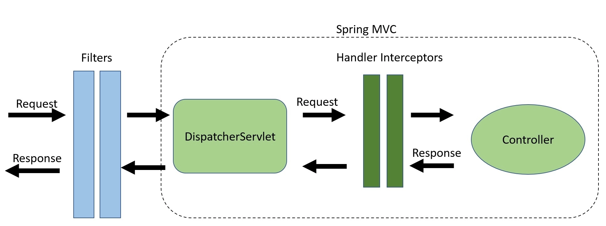

## Spring MVC

Spring’s web MVC(Model View Controller) framework is request-driven, designed around a central Servlet that dispatches requests to controllers and offers other functionality that facilitates the development of web applications. Spring’s DispatcherServlet however, does more than just that. It is completely integrated with the Spring IoC container and as such allows you to use every other feature that Spring has.
* Model: The Model component corresponds to all the data-related logic that the user works with. This can represent either the data that is being transferred between the View and Controller components or any other business-related data.

* View: The View component is used for all the UI logic of the application. This would be your JSPs, HTMLs, Thymeleaf templates, etc.

* Controller: The Controller component corresponds to the business logic that interacts with the Model and selects a View to be rendered based on the user input and the data obtained from the Model.

Spring Boot works perfectly with Spring MVC as it simplifies the application setup even further, including setting up a dispatcher servlet, configuring web resources, resolving views, and more. 

### Overview of Spring MVC Processing Sequence

The processing flow of Spring MVC from receiving the request till the response is returned is shown in the following diagram.

1. DispatcherServlet receives the request.
2. DispatcherServlet dispatches the task of selecting an appropriate controller to HandlerMapping. HandlerMapping selects the controller which is mapped to the incoming request URL and returns the (selected Handler) and Controller to DispatcherServlet.
3. DispatcherServlet dispatches the task of executing of business logic of Controller to HandlerAdapter.
4. HandlerAdapter calls the business logic process of Controller.
5. Controller executes the business logic, sets the processing result in Model and returns the logical name of view to HandlerAdapter.
6. DispatcherServlet dispatches the task of resolving the View corresponding to the View name to ViewResolver. ViewResolver returns the View mapped to View name.
7. DispatcherServlet dispatches the rendering process to returned View.
8. View renders Model data and returns the response.

### Spring MVC with Spring Boot

Spring Boot provides auto-configuration for Spring MVC that works well with most applications. The Spring Boot Starter Web is starter for building web, including RESTful, applications using Spring MVC. It uses Tomcat as the default embedded container. It sets up Spring MVC with defaults like registering DispatcherServlet, enabling Jackson for object-to-json marshalling/unmarshalling for REST endpoints, setting up view resolution with a prefix of /WEB-INF/jsp/ and a suffix of .jsp, etc.

* DispatcherServlet: This is the front controller in the Spring MVC application that takes an incoming HTTP request and delegates it to the appropriate controller. In a Spring Boot application, a DispatcherServlet is auto-configured by default when you have spring-boot-starter-web dependency in your classpath. By default, the spring-boot-starter-web starter configures DispatcherServlet to the URL pattern “/”. So, we don't need to complete any additional configuration for the above DispatcherServlet example in the web.xml file. However, we can customize the URL pattern using server.servlet.* in the application.properties file.

* @RequestMapping: This is used to map web requests onto specific handler classes and/or handler methods. @GetMapping, @PostMapping, @PutMapping, @DeleteMapping, and @PatchMapping are specialized versions of @RequestMapping that correspond to HTTP GET, POST, PUT, DELETE, and PATCH requests, respectively.

* @Controller: This is a class-level annotation that marks the class as a Spring MVC controller. @Controller classes process incoming HTTP requests and return a view (typically an HTML page).

* @ResponseBody: This is a method-level annotation that can be included in @Controller classes (it's included by default in @RestController classes). When a method is annotated with @ResponseBody, the return value of the method is written directly to the HTTP response body. This is typically used when you're writing RESTful APIs.

* @RestController: This is a specialized version of the @Controller annotation. It includes the @ResponseBody annotation, which means that return values from methods in the @RestController class are bound directly to the HTTP response body. This is typically used for RESTful APIs where you're returning JSON or XML data instead of an HTML view.

* @RequestMapping: This is used to map web requests onto specific handler classes and/or handler methods. @GetMapping, @PostMapping, @PutMapping, @DeleteMapping, and @PatchMapping are specialized versions of @RequestMapping that correspond to HTTP GET, POST, PUT, DELETE, and PATCH requests, respectively.

* @PathVariable: This is used to bind a method parameter to a path variable in the incoming request.

* @RequestParam: This is used to bind a method parameter to a request parameter in the incoming request.

* @RequestBody: This annotation is used to bind the HTTP request body with a method parameter in your controller. It is typically used in methods that handle HTTP POST requests where the request body contains the data to be created or updated.

* @Valid: This annotation is used to validate an object before it is used in a method. It is often used in conjunction with @RequestBody to validate the incoming data.

The @RestController annotation is used in Spring MVC, and it combines the @Controller and @ResponseBody annotations. This indicates that all public methods in the class will have their return values written to the body of the HTTP response. So when the @RestController annotation is used:

* The Controller processes the request and places the processing result in a Model. However, when @RestController is used, a data object is usually returned instead of a Model. Because this object is marked with the @ResponseBody annotation, it is written to the body of the HTTP response.

* The Controller does not return a View name. Instead, methods marked with the @RestController annotation write the data they return directly to the body of the HTTP response.

* The DispatcherServlet does not send a View resolution task to the ViewResolver. This is because the data returned by a method marked with the @RestController annotation is not a View name, but data to be written to the response.

* There is no View rendering process. Instead, the data returned by a method marked with the @RestController annotation is written directly to the body of the HTTP response

### Filters And HandlerInterceptors

#### Filters

Filters are part of the webserver and not the Spring framework. For incoming requests, we can use filters to manipulate and even block requests from reaching any servlet. Vice versa, we can also block responses from reaching the client.

Spring Security is a great example of using filters for authentication and authorization.

#### HandlerInterceptors

HandlerInterceptors are part of the Spring MVC framework and sit between the DispatcherServlet and our Controllers. We can intercept requests before they reach our controllers, and before and after the view is rendered.

To create a HandlerInterceptor, we create a class that implements the org.springframework.web.servlet.HandlerInterceptor interface. This gives us the option to override three methods:

preHandle() – Executed before the target handler is called
postHandle() – Executed after the target handler but before the DispatcherServlet renders the view
afterCompletion() – Callback after completion of request processing and view rendering

The key takeaway is that with Filters, we can manipulate requests before they reach our controllers and outside of Spring MVC. Otherwise, HandlerInterceptors are a great place for application-specific cross-cutting concerns. By providing access to the target Handler and ModelAndView objects, we have more fine-grained control.

### Listeners 

A Listener in Spring Boot is a component that listens for specific application events to occur. These events could be standard Java EE events (such as ServletContextListener) or Spring-specific events. You can define your own listener by implementing the ApplicationListener interface or using the @EventListener annotation.

## Custom Servlet 

In Java web applications, a servlet is a class that handles requests, processes them, and replies back with a response. The javax.servlet.http.HttpServlet is an abstract class in Java Servlet API, and it provides methods, such as doGet(), doPost(), doPut(), doDelete(), etc., to handle HTTP requests.

The CustomServlet class i have created is a subclass of HttpServlet, meaning it's a specific type of servlet that can handle HTTP requests.

The doGet() method is invoked for HTTP GET requests. This is where you would handle the processing for GET requests. When a GET request is received, the log message "CustomServlet doGet() method is invoked" will be written to the logs.

The doPost() method is invoked for HTTP POST requests. This is where you would handle the processing for POST requests. When a POST request is received, the log message "CustomServlet doPost() method is invoked" will be written to the logs.
