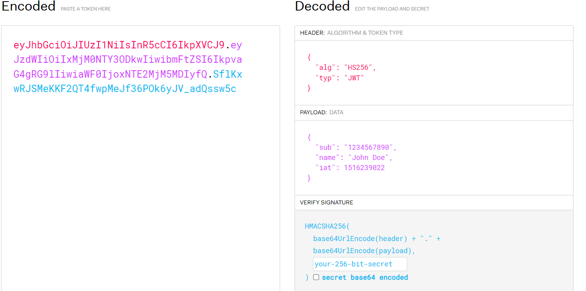
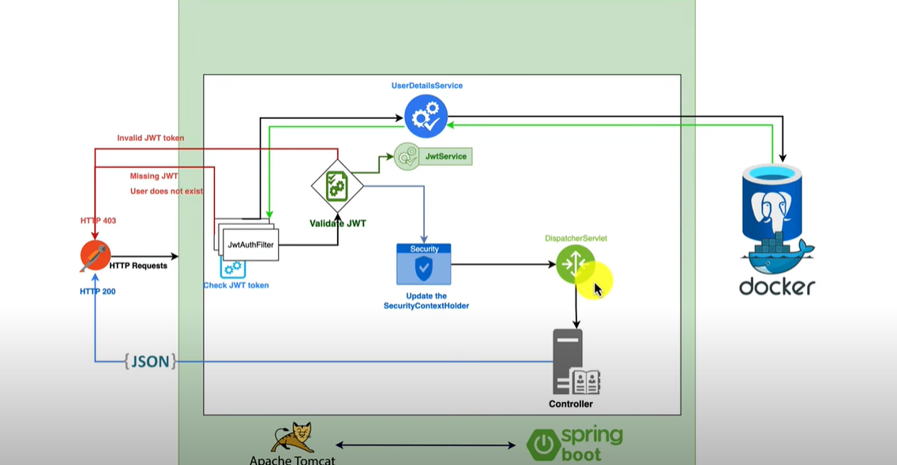

## Spring Security with Jwt

Structure of a Jwt token:



The Header section specifies the algorithm used to encrypt the token.

The Payload section contains information such as the subject, creation time, and expiration time of the token. The subject identifies the user on whose behalf the token was generated and should be a unique value such as a username or email. Other parameters can also be added to the payload during token creation.

The Signature section contains a signature used for verifying the authenticity of the token. The server checks if it was produced by itself during token generation.

How Jwt security works:



For each request, the JwtAuthenticationFilter we created runs first.

This filter first checks if there is a token in the Authorization header of the request. If not, a "missing jwt" response is returned.

If a token is present, the subject (user email in this project) is extracted from the token. During extraction, the signature is checked to verify that it was produced by the server. If it was not produced by the server, a 403 error is returned.

The UserDetailsService is then called to retrieve the user associated with this subject. If the user does not exist, a "user not exist" response is returned.

If the user exists, a call is made to JwtService with the token to check if the token has expired. If it has expired, a "token not valid" response is returned.

If the token is valid, the SecurityContextHolder is updated. Then, in other code blocks running on the same thread, the authenticated user's subject can be obtained by calling SecurityContextHolder.getContext().getAuthentication().getPrincipal().

After updating, the request is automatically dispatched. The request is directed to the relevant controller via the DispatcherServlet.


Required dependencies: 
```
		<dependency>
			<groupId>org.springframework.boot</groupId>
			<artifactId>spring-boot-starter-security</artifactId>
		</dependency>
            <groupId>io.jsonwebtoken</groupId>
			<artifactId>jjwt-api</artifactId>
			<version>0.11.5</version>
		</dependency>
		<dependency>
			<groupId>io.jsonwebtoken</groupId>
			<artifactId>jjwt-impl</artifactId>
			<version>0.11.5</version>
		</dependency>
		<dependency>
			<groupId>io.jsonwebtoken</groupId>
			<artifactId>jjwt-jackson</artifactId>
			<version>0.11.5</version>
		</dependency>
```

Glossary

JWT : İnternet üzerinde kullanıcıların kimlik doğrulamasını sağlamak için kullanılan bir veri formatıdır. JWT'ler, veri transferi sırasında doğrulama bilgilerini (örneğin kullanıcı adı, şifre vb.) taşımak için kullanılır.JWT, 3 bölümden oluşur: header, payload ve signature. Header, tokenın tipini ve kullanılan algoritmayı belirtir. Payload, kullanıcının kimlik doğrulaması için gereken verileri içerir. Signature ise, tokenın doğruluğunu doğrulamak için kullanılan bir anahtar ile imzalanmıştır.

Authentication : Uygulamaya erişmek isteyen kullanıcının bilgilerinin kontrol edilmesi işlemidir.

Authorization : Authentication işleminin başarılı olması durumunda, kullanıcıya ait authoritiy(rol)'lerin kontrol edilerek erişmek istediği endpointe izin verilip verilmemesi işlemidir.

Claim : JWT'nin payload kısmında bulunan parametrelerdir. Token oluşturulurken subject , exp (expiration date) gibi claimler dışında istenilen extra claimler de eklenebilir.

Spring Security'nin kimlik doğrulama sürecinde kullanıcı bilgilerine ihtiyacı vardır. Bu bilgileri sağlamak ve yönetmek için UserDetails ve UserDetailsService arayüzlerini kullanır. Bu sayede, kimlik doğrulama sürecini uygulamanızın kullanıcı modeline ve depolama yöntemine göre özelleştirebilirsiniz.

UserDetails: Bu, Spring Security tarafından kullanılan bir kullanıcı temsilidir. Kullanıcının kimlik doğrulama sürecindeki temel bilgilerini içerir, özellikle kullanıcı adı, şifre ve yetkilendirmeler (roller ve yetkiler) gibi bilgileri sağlar.

UserDetailsService:  Bu, kullanıcı detaylarını yüklemek için kullanılan bir servistir. loadUserByUsername adında tek bir metod içerir ve bu metod kullanıcı adına göre UserDetails nesnesi döndürür. Bu servis, kullanıcıları veritabanından veya harici bir kaynaktan yüklemek için kullanılabilir.

Responsibility Chain Pattern : Bir dizi nesnenin birbirleri arasında işlemleri veya istekleri yönlendirdiği ve gerçekleştirdiği bir yapı sağlayan design patterndir. Spring Security, bu patterni kullanarak güvenlik filtrelerini yönetir.

Spring Security filter chain: İstek işleme sırasında çalışan bir dizi filtre içerir. İstek, filtrelerin her birine sırayla iletilir ve her filtre, özelleştirilmiş bir işlem gerçekleştirir. İşlem tamamlandığında, istek zincirdeki bir sonraki filtreye geçer.

Basic Authentication: Kullanıcının username, passsword bilgileri ile authentication ve authorization işlemlerinin yapılmasıdır. Burada token kullanılmaz her istekte username , password bilgisi olmalıdır. Ek bir bir filtreye ihtiyaç duyulmaz spring security filter chaindeki default filtreler yeterlidir.

SecurityContext : Threadlocal  bir nesnedir. Bir thread sadece kendi set ettiği değeri okuyabilir. Authentication işleminin başarılı olması durumunda, kullanıcı ya ait bilgiler ile güncellenir. İstek bittiği zaman temizlenir.

JwtAuthenticationFilter : Jwt uygulamak için security filter chain' e eklediğimiz filtre. Bu filtrede token'ın kontrolü, token'daki subjecte göre kontroller yapılır ve başarılı olması durumunda kullanıcı bilgileri SecurityContext' e işlenir. Bu filtre security filter chain' e eklenir ve login , register gibi izin verilmiş endpointler dışında diğer tüm isteklerde çalışır.

UsernamePasswordAuthenticationToken: Spring Security'de kullanılan temel kimlik doğrulama nesnesidir. Bu sınıf, kullanıcı adı ve şifre bilgilerini içeren bir kimlik doğrulama nesnesi oluşturmak için kullanılır.


